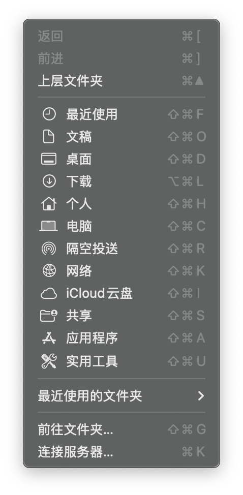
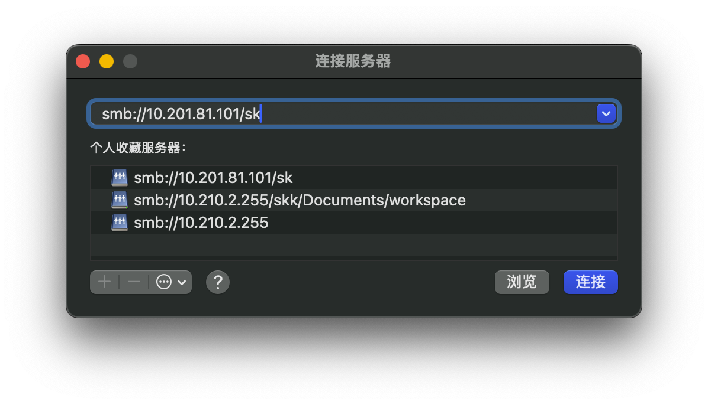

# 配置SSH远程访问和Samba远程文件系统服务

默认的系统环境为Ubuntu 24.04

## 换软件包源(可选)

Ubuntu默认走`archive.ubuntu.com`的国外源, 如果不挂梯子速度很慢, 建议换成国内源, 例如清华源.

[清华源官方网站](https://mirrors.tuna.tsinghua.edu.cn/help/ubuntu/)

Ubuntu在24.04之后的配置文件发生了改变, 对于Ubuntu >= 24.04版本, 执行
```bash
# 备份原有的源列表	
sudo mv /etc/apt/sources.list.d/ubuntu.sources /etc/apt/sources.list.d/ubuntu.sources.bak
# 创建新的源列表
echo "Types: deb
URIs: http://mirrors.tuna.tsinghua.edu.cn/ubuntu
Suites: noble noble-updates noble-backports
Components: main restricted universe multiverse
Signed-By: /usr/share/keyrings/ubuntu-archive-keyring.gpg

Types: deb
URIs: http://security.ubuntu.com/ubuntu/
Suites: noble-security
Components: main restricted universe multiverse
Signed-By: /usr/share/keyrings/ubuntu-archive-keyring.gpg" | sudo tee /etc/apt/sources.list.d/ubuntu.sources
```
然后更新软件包缓存
```bash
sudo apt update
# 对于新系统建议执行一次全面更新
sudo apt upgrade
```

对于Ubuntu < 24.04版本, 执行
```bash
sudo mv /etc/apt/sources.list /etc/apt/sources.list.bak
echo "deb http://mirrors.tuna.tsinghua.edu.cn/ubuntu/ noble main restricted universe multiverse
# deb-src http://mirrors.tuna.tsinghua.edu.cn/ubuntu/ noble main restricted universe multiverse
deb http://mirrors.tuna.tsinghua.edu.cn/ubuntu/ noble-updates main restricted universe multiverse
# deb-src http://mirrors.tuna.tsinghua.edu.cn/ubuntu/ noble-updates main restricted universe multiverse
deb http://mirrors.tuna.tsinghua.edu.cn/ubuntu/ noble-backports main restricted universe multiverse
# deb-src http://mirrors.tuna.tsinghua.edu.cn/ubuntu/ noble-backports main restricted universe multiverse

deb http://security.ubuntu.com/ubuntu/ noble-security main restricted universe multiverse
# deb-src http://security.ubuntu.com/ubuntu/ noble-security main restricted universe multiverse" | sudo tee /etc/apt/sources.list
```
这里面`noble`是Ubuntu 24.04的代号, 如果你使用的是其他版本, 请替换成对应的代号. 完整内容参考清华镜像源官网.

## 安装SSH服务

首先安装SSH服务
```bash
sudo apt install ssh
```
然后配置一些选项
```bash
sudo vim /etc/ssh/sshd_config
```
在配置文件中, 可以修改以下选项:
```conf
PasswordAuthentication yes  # 是否允许密码登录
PermitRootLogin prohibit-password  # 是否允许root用户登录, 禁止密码登录, 只允许密钥登录
PubkeyAuthentication yes  # 是否允许密钥登录, 可以通过公钥免密码登录

# 如果要使用X11转发使用图形界面
AllowTcpForwarding yes  # 是否允许TCP转发
X11Forwarding yes  # 是否允许X11转发
X11UseLocalhost no  # 是否允许X11转发到本地, 如果设置为no, 则可以通过SSH转发X11到远程主机
X11DisplayOffset 10
```
修改完成后, 重启SSH服务使配置生效
```bash
sudo systemctl restart ssh
```
确认`ssh`服务开机自启
```bash
sudo systemctl enable ssh
```
接着可以在另一台电脑上测试SSH连接, 通过以下命令查看本机IP地址
```bash
ip a
# 1: lo: <LOOPBACK,UP,LOWER_UP> mtu 65536 qdisc noqueue state UNKNOWN group default qlen 1000
#     link/loopback 00:00:00:00:00:00 brd 00:00:00:00:00:00
#     inet 127.0.0.1/8 scope host lo
#        valid_lft forever preferred_lft forever
#     inet6 ::1/128 scope host noprefixroute 
#        valid_lft forever preferred_lft forever
# 2: enp13s0: <BROADCAST,MULTICAST,UP,LOWER_UP> mtu 1500 qdisc fq_codel state UP group default qlen 1000
#     link/ether 34:5a:60:5e:d5:45 brd ff:ff:ff:ff:ff:ff
#     inet <有线网线连接IPv4> brd 10.201.255.255 scope global dynamic noprefixroute enp13s0
#        valid_lft 2161sec preferred_lft 2161sec
#     inet6 <有线网络连接IPv6> scope link noprefixroute 
#        valid_lft forever preferred_lft forever
# 3: wlp14s0: <BROADCAST,MULTICAST> mtu 1500 qdisc noop state DOWN group default qlen 1000
#     link/ether d8:b3:2f:c3:4b:e5 brd ff:ff:ff:ff:ff:ff
# 4: docker0: <NO-CARRIER,BROADCAST,MULTICAST,UP> mtu 1500 qdisc noqueue state DOWN group default 
#     link/ether 46:40:2c:2b:59:60 brd ff:ff:ff:ff:ff:ff
#     inet 172.17.0.1/16 brd 172.17.255.255 scope global docker0
#        valid_lft forever preferred_lft foreve
```
其中`enp`开头的是有线网卡, `wlp`开头的是无线网卡, 你可以根据实际情况选择对应的IP地址. 在客户机上, 使用`ssh user@ip`命令连接到服务器.

### 配置公钥(免密码自动登录)

在客户机上(你的工作机)上先生成SSH公钥和私钥, 如果之前生成过可以略去这一步
```bash
ssh-keygen -t rsa -b 4096 -C "<你的邮箱地址>"
```
然后一路回车确认, 生成的公钥和私钥默认保存在`~/.ssh/id_rsa.pub`和`~/.ssh/id_rsa`中.

接着将公钥复制到服务器上, 使用以下命令
```bash
ssh-copy-id user@ip
```
过程中会要求输入服务器的密码, 输入后会将公钥复制到服务器的`~/.ssh/authorized_keys`文件中.

另外, 可以在客户机的`~/.ssh/config`文件中添加以下内容, 方便以后连接, 例如
```conf
Host HIQC_CPU
	HostName <服务器IP地址>
	User <用户名>
	Port 22
```
这样以后就可以直接使用`ssh HIQC_CPU`命令连接到服务器了. 服务器名称可以自己选择

## 安装Samba服务
Samba是一个开源的文件共享服务, 可以让Linux和Windows系统之间共享文件, 然后无缝集成到本机的文件管理器中. 首先安装Samba服务
```bash
sudo apt install samba
```
然后配置Samba服务, 编辑配置文件
```bash
# 备份原有的配置文件
sudo mv /etc/samba/smb.conf /etc/samba/smb.conf.bak
# 创建新的配置文件
sudo vim /etc/samba/smb.conf
```
在配置文件中添加以下内容, 这里以共享用户的主目录为例, 例如服务器的用户为`user`, 那么这样会共享`/home/user`目录
```toml
[global]
   workgroup = WORKGROUP
   server string = Samba Server %v (HIQC_CPU, Ubuntu)
   netbios name = <服务器名称>
   security = user
   map to guest = bad user
   dns proxy = no
   passdb backend = tdbsam
   load printers = no
   log file = /var/log/samba/%m.log
   max log size = 1000

[home]
   comment = Home Directory
   read only = no
   browsable = yes
   writable = yes
   create mask = 0644
   directory mask = 0775
   guest ok = no
```
这里的`<服务器名称>`可以替换成你自己的服务器名称, 例如`HIQC_CPU`. 保存并退出编辑器.

然后通过以下命令创建Samba密码
```bash
sudo smbpasswd -a $(whoami)
```
这会提示你输入密码, 输入后会将当前用户添加到Samba用户列表中. 密码和用户系统的密码可以不同, 为了方便可以保持一致.

接着运行以下命令检查Samba配置是否正确
```bash
testparm
```
如果没有报错, 则表示配置正确. 然后重启Samba服务使配置生效
```bash
sudo systemctl restart smbd
```
在客户机上, 可以通过以下方法查看Samba共享目录.

- Windows: 在文件资源管理器的地址栏中输入`\\<服务器IP地址>\<用户名>`. 会提示输入用户名和密码, 用户就是服务器系统用户名, Samba是之前设置的Samba密码, 然后即可访问共享目录.
- Linux: 在文件管理器(例如Nautilus)的地址栏中输入`smb://<服务器IP地址>/<用户名>`, 会提示输入用户名和密码, 用户同样是服务器系统用户名, Samba是之前设置的Samba密码, 然后即可访问共享目录.
- macOS: 在Finder中, 按下`Command + K`打开连接服务器对话框, 或者在Finder的菜单栏中选择`前往 -> 连接服务器`, 然后输入`smb://<服务器IP地址>/<用户名>`, 会提示输入用户名和密码, 用户同样是服务器系统用户名, Samba是之前设置的Samba密码.





这里的图片参考只有macOS的, 因为手头上只有这个macOS设备, 可以补充一下其它平台上的截图.

连接到Samba共享目录后, 可以像访问本地文件一样访问远程文件(等于挂载了一个网络硬盘, 和本地的文件管理器无缝集成), 直接复制/剪切/粘贴文件即可.

为了方便使用, 可以在第一次连接Samba的时候保存用户密码, 并且将共享目录添加到文件管理器的固定书签中.